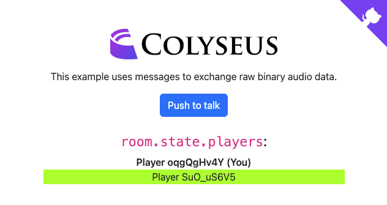

# Colyseus: Push To Talk Example



This example is built for the web platform, and uses:

- [`navigator.mediaDevices.getUserMedia()`](https://developer.mozilla.org/en-US/docs/Web/API/MediaDevices/getUserMedia)
- [`MediaRecorder`](https://developer.mozilla.org/en-US/docs/Web/API/MediaRecorder)
- [`MediaStream`](https://developer.mozilla.org/en-US/docs/Web/API/MediaStream)
- [`Audio`](https://developer.mozilla.org/en-US/docs/Web/API/HTMLAudioElement/Audio)

## Running locally

Start the client:

```
cd client
npm install
cd start
```

Start the server:

```
cd server
npm install
npm start
```

Open [http://localhost:1234](http://localhost:1234) in your browser.

## License

MIT